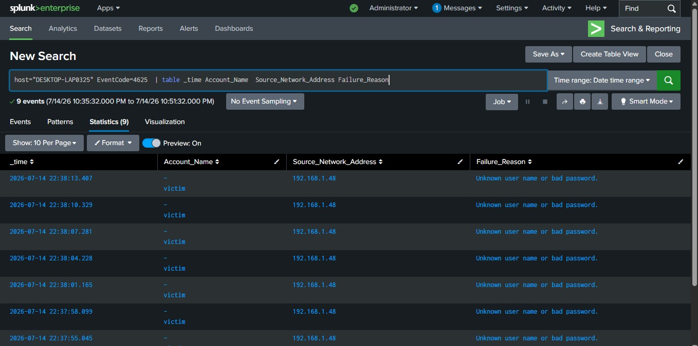
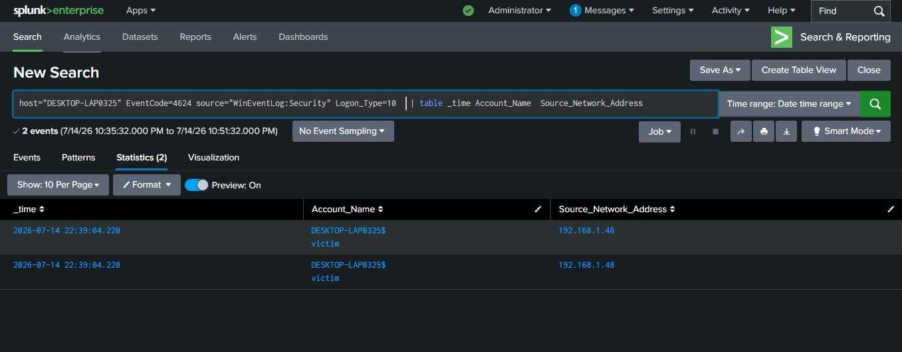
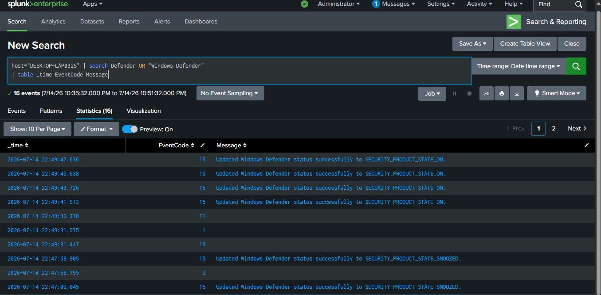
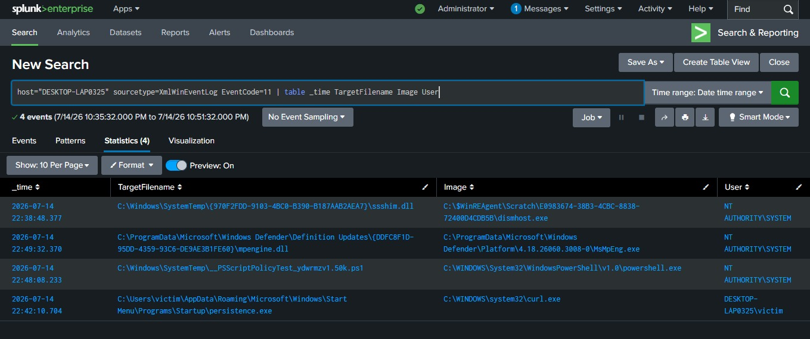
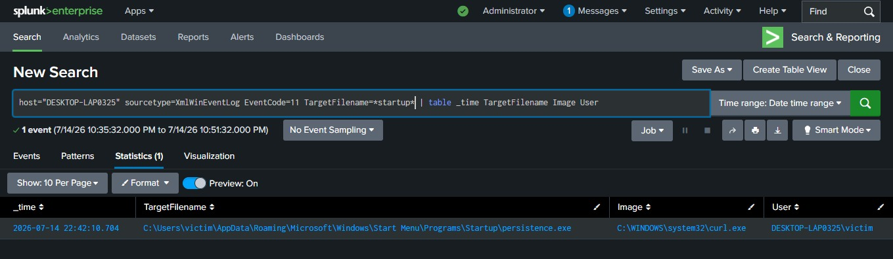
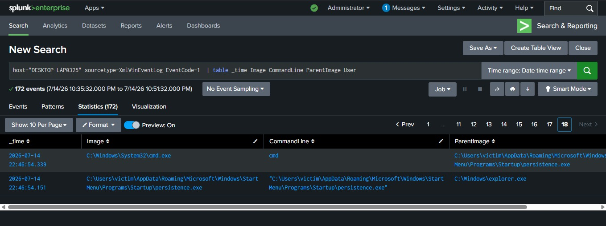
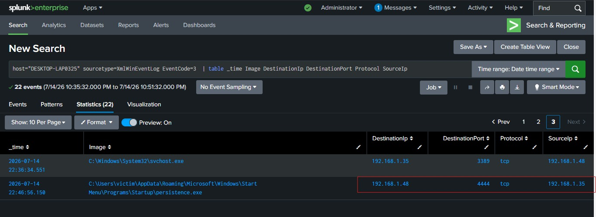
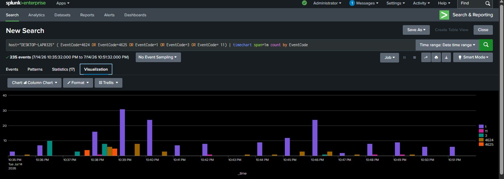
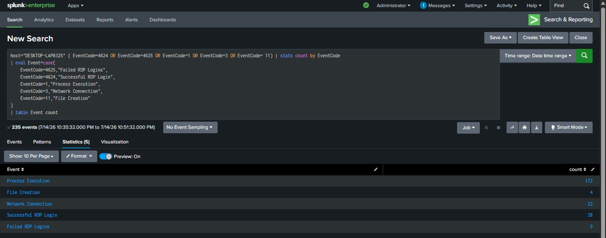
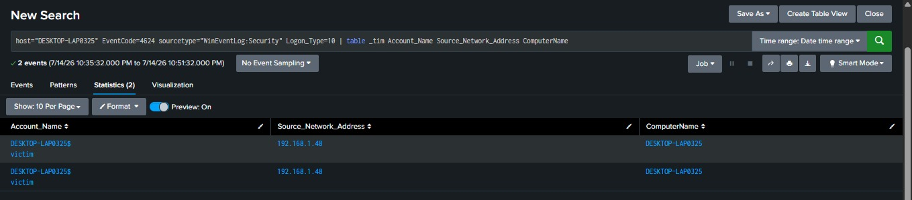

# SOC-RDP-Bruteforce-Persistence-Splunk

## Project Overview

This project demonstrates a Security Operations Center (SOC) investigation of a simulated cyber attack against a Windows machine. The attack involved RDP brute-force authentication, successful remote access, Microsoft Defender tampering, payload deployment, persistence using the Startup folder, and a reverse shell connection. The investigation was performed using Splunk Enterprise, Sysmon, and Windows Event Logs.

---

## Objective

The objective of this project is to detect, investigate, and reconstruct an attack using Splunk SPL queries while mapping the attack to the MITRE ATT&CK framework.

---

## Lab Environment

| Component | Description |
|-----------|-------------|
| Attacker Machine | Kali Linux |
| Victim Machine | Windows 11 |
| SIEM | Splunk Enterprise |
| Log Forwarder | Splunk Universal Forwarder |
| Endpoint Monitoring | Sysmon |
| Virtualization | VirtualBox |

---

## Attack Scenario

The simulated attack followed these stages:

1. RDP brute-force attack against the Windows system.
2. Successful RDP authentication using valid credentials.
3. Microsoft Defender disabled.
4. Payload downloaded to the victim.
5. Payload copied to the Startup folder for persistence.
6. Payload executed.
7. Reverse shell established with the attacker's machine.
8. Incident investigated using Splunk.

---

## MITRE ATT&CK Mapping

For the complete MITRE ATT&CK mapping, see:

[MITRE ATT&CK Mapping](docs/mitre_attack_mapping.md)
---

## Investigation Steps

### Step 1 – Failed RDP Logins

---

### Step 2 – Successful RDP Login

---

### Step 3 – Microsoft Defender Disabled

---

### Step 4 – Payload Download

---

### Step 5 – Startup Folder Persistence

---

### Step 6 – Payload Execution

---

### Step 7 – Reverse Shell Connection

---

### Step 8 – Attack Timeline

---

### Step 9 – Statistics

---

### Step 10 – Detection Rule

---

## SPL Queries

All Splunk SPL queries used during this investigation are available here:

[SPL Queries](queries/spl_queries.md)

---

## Indicators of Compromise (IOCs)

The collected Indicators of Compromise (IOCs) are documented here:

[Indicators of Compromise (IOCs)](docs/iocs.md)

---

## Skills Demonstrated

- Security Monitoring
- SOC Investigation
- Splunk Enterprise
- SPL Query Development
- Windows Event Log Analysis
- Sysmon Log Analysis
- Incident Response
- Threat Hunting
- MITRE ATT&CK Mapping

---

## Conclusion

This project demonstrates how a SOC analyst can investigate an RDP-based compromise by analyzing Windows and Sysmon logs in Splunk. The investigation reconstructs the attack lifecycle, identifies key indicators of compromise, and maps attacker behavior to the MITRE ATT&CK framework.
